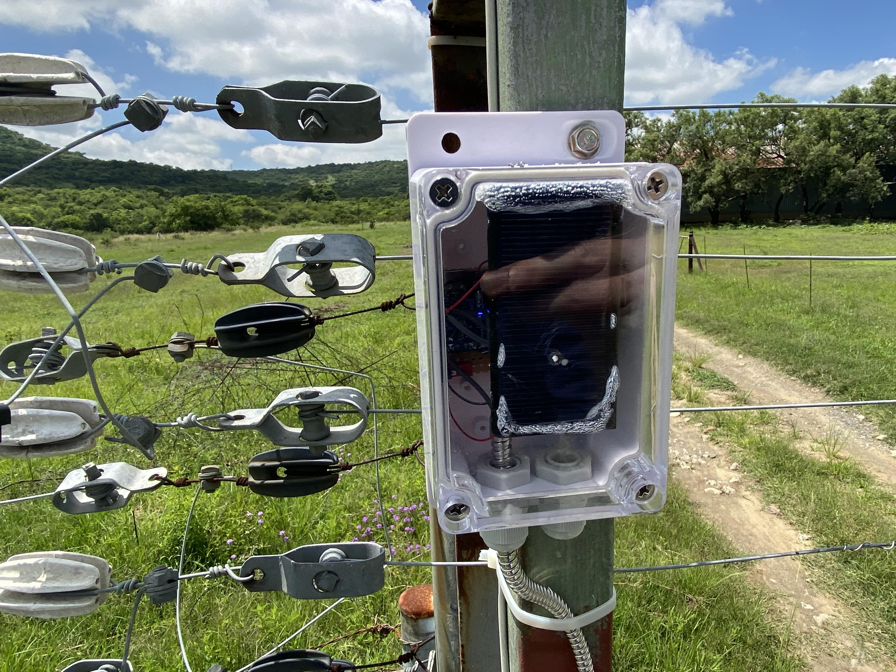

# ATTiny412 Magnetic Reed Notifier

A simple Magnetic Reed Notifier working exclusively on battery and solar power.

The device sends a heartbeat to the Roboguard HQ device every 15 mins.

The device has an internal switch so that the device can be learned on the Roboguard HQ.

The device has a tamper function (not used in this case).

An alarm signal is sent every 5 seconds when the reed switch is opened.

700mAh 16340 battery lasts for just over 7 days tested from full battery.

4mA standby 10mA TX

700/4 = 175 hours

# Other Notes (ATTINY412)

*Oscillators and Clocks*

**32KHz Oscillator (OSCULP32K)**

The 32KHz oscillator is optimized for Ultra Low Power (ULP) operation. Power consumption is decreased

at the cost of decreased accuracy compared to an external crystal oscillator.

This oscillator also provides the 1KHz signal for the Real Time Counter (RTC), the Watchdog Timer
(WDT), and the Brownout Detector (BOD).

The start-up time of this oscillator is the oscillator start-up time plus 4 oscillator cycles. Refer to Electrical
Characteristics chapter for the start-up time.

**Sleep Modes**

In addition to Active mode, there are three different sleep modes, with decreasing power consumption
and functionality.

*Idle* The CPU stops executing code, no peripherals are disabled.
All interrupt sources can wake up the device.

*Standby* The user can configure peripherals to be enabled or not, using the respective RUNSTBY bit.
This means that the power consumption is highly dependent on what functionality is enabled,
and thus may vary between the Idle and Power Down levels.
SleepWalking is available for the ADC module.
The wake-up sources are Pin interrupts, TWI address match, UART Start-of-Frame interrupt
(if USART is enabled to run in Standby), RTC interrupt (if RTC enabled to run in Standby),
and TCB interrupt.

*Power*
*Down*
Only the WDT and the PIT (component of the RTC) are active.

The only wake-up sources are the pin change interrupt and TWI address match.

**Initialization**

After Reset, all standard function device I/O pads are connected to the PORT with outputs tri-stated and
input buffers enabled, even if there is no clock running.
For best power consumption, disable the input of unused pins and pins that are used as analog inputs or
outputs.
Specific pins, such as those used for connecting a debugger, may be configured differently, as required
by their special function

# versions

V1:
- LD1117 regulator
- IRF9540 mosfet
- BAT85 schottky

V1.3:

Uses mostly SMD parts

- LD1117 replaced with FS8860C33H regulator
- IRF9540 replaced with SI2303 p-channel mosfet
- BAT85 replaced with BAT54S schottky

# Index
- 1

# Components

Component list:
- Battery
    - 1x 3.7v, 2.59wh, 700mAh lipo (ICR 16340) battery
    - 1x battery holder
- Charge Module
    - 1x TP4056 with protection
- Diodes
    - 2x BAT54S Schottky diodes
- Mosfets
    - 1x SI2303 P-channel
- Regulator
    - 1x FS8860C33H LDO 3.3v
- Microcontroller
    - 1x ATtiny412
- Capacitors
    - 1x 100nf
    - 1x 10uf
    - 2x 100uf
- Resistors
    - 1x 10k
- Transmitter
    - 1x WL102-341 3.3v 433.92 Mhz RF
- PCB Switch
    - 1x 1pin dip switch
- Magnetic Switch
    - 1x reed switch
- Case
    - 1x Sonoff case
- Wires
    - 1x red roll
    - 1x black roll

# Transmitter Details

- About the transmitter module (square shape)
    - Model: WL102-341
    - Material: Plastic Metal
    - Colour: shown as pictures
    - Size: 16x12x1mm
    - Operating frequency: 433.92 MHz
    - Mains input voltage range: 2.0V-3.6V
    - Shutdown mode current is less than 1uA
    - Transfer rate: up to 20KHz
    - Launch distance: 20-200 meters
    - External antenna: 25cm ordinary multi-core or single-core line
    - Temperature range: -45℃～85℃
    - Operating current :20-28mA
    - Output Power: 11dBm
    - Modulation mode: OOK (Amplitude Modulation)