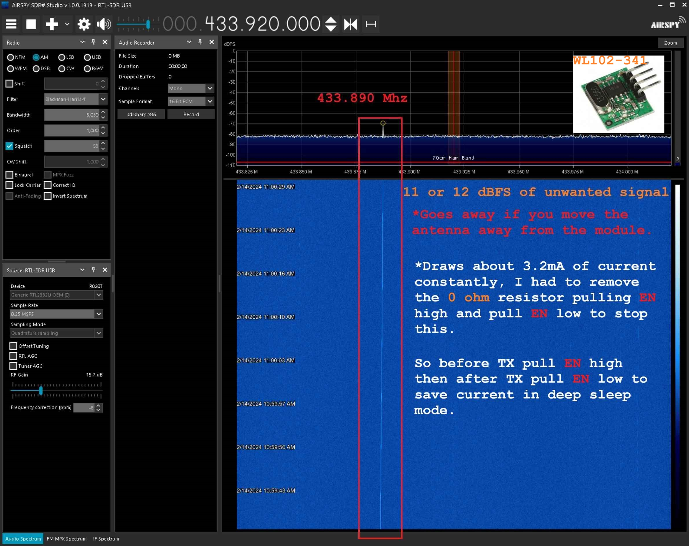
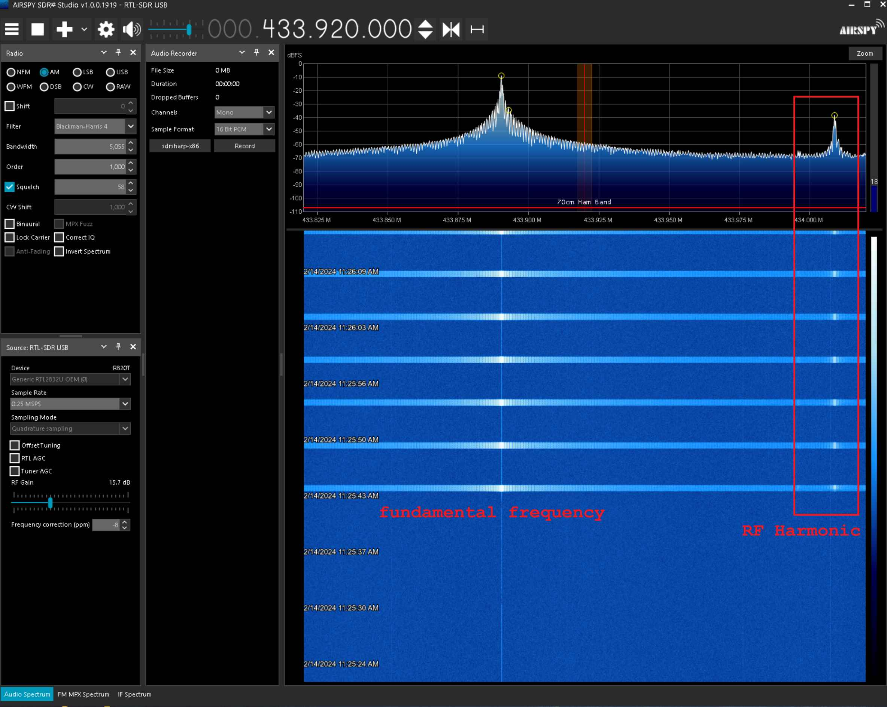

# ATTiny412 Magnetic Reed Notifier

A simple Magnetic Reed Notifier working exclusively on battery and solar power.

The device sends a heartbeat to the Roboguard HQ device every 15 mins.

The device has an internal switch so that the device can be learned on the Roboguard HQ.

The device has a tamper function (not used in this case).

An alarm signal is sent every 5 seconds when the reed switch is opened.

*Some quick tests:*

## Using internal pullups ATtiny412, 8MHz clock, LD1117 & WL102-341

The LD1117 has a 1V drop what a pain.

| Battery Capacity  | Battery Type  | Regulator | Current Drain (sleep) | Current Drain (5s Run) | Current Drain (TX) | Clock  | Circuit Lasting Time (*only sleep mode)  |
| :------------ | :------------ | :------------| :------------| :------------ | :------------  | :------------ | :------------ | 
|700mAh |16340 | LD1117 | +-4mA | +-6mA| +-16mA |8MHz  |+-7 days | 

WL102-341 chip EN pin constantly on wasteing current.

Had to Add another 1.5mA to account for LD1117 dropout and other small current draws in the older circuit.

700/4 = 175 hours = 7 days roughly.

However the voltage does drop below 3v when the battery gets low.

Luckily the ATTINY412 and WL102-341 can operate below 3v.. but still not what I want.

## Using internal pullups ATtiny212, 1MHz clock, FS8860C33H LDO 3.3v & WL102-341 (EN off)

The FS8860C33H is an old chip but has very little drop but has about +-50μA quiescent current... the datasheet doesn't say.

| Battery Capacity  | Battery Type  | Regulator | Current Drain (sleep) | Current Drain (5s Run) | Current Drain (TX) | Clock  | Circuit Lasting Time (*only sleep mode)  |
| :------------ | :------------ | :------------| :------------| :------------ | :------------  | :------------ | :------------ | 
|700mAh |16340 | FS8860C33H | +-262.4μA| +-777.3μA| +-12.5mA |1MHz  |+-111.15 days | 

WL102-341 chip EN pin resistor was removed (held high before TX).

700/0.2624 = 2,667.68 hours = 111.15 days roughly.

No significant voltage drop.

## Using 22MΩ external resistors ATtiny212, 1MHz clock, HT7333 LDO 3.3v & WL102-341 (EN off)

External pullup resistor calculation

3.3V/22000k = 0.00015 = 0.15uA = 150nA

datasheet min = 50nA

22M is ok @ 3.3V

2.5V/22000k = 0.0001136 = 0.1136uA = 114nA

22M is ok still ok @ 2.5V

So 22M will work at max 3.3v and min 2.4V voltages without going below 50nA

-

The HT7333 is awesome... 250mA max with a quiescent current of 3.5μA - 7.0μA and a very low dropout voltage.

| Battery Capacity  | Battery Type  | Regulator | Current Drain (sleep) | Current Drain (5s Run) | Current Drain (TX) | Clock  | Circuit Lasting Time (*only sleep mode)  |
| :------------ | :------------ | :------------| :------------| :------------ | :------------  | :------------ | :------------ | 
|700mAh |16340 | HT7333-A | +-10.24μA| +-644.1μA| +-12.0mA |1MHz  |+-2916.67 days | 
|550mAh |13400 | HT7333-A | +-10.24μA| +-644.1μA| +-12.0mA |1MHz  |+-2291.67 days | 

Changed battery to a common vape 13400 550mAh

700/0.01 = 70,000 hours = 2916.67 days roughly.

550/0.01 = 55,000 hours = 2291.67 days roughly.

# Index
- Power Consumption
- Other Notes (ATTINY412)
- Versions
- Components
- Transmitter Details
- Problems and fixes
- 

# Power Consumption

### Active Mode

Active power consumption

| Condition  |  Voltage | Typical Current  | Minimum Current  |
| :------------ | :------------ | :------------ | :------------ | 
|CLK_CPU=`20MHz` (OSC20M)      |VDD=5V  |9.0mA  |- 
|CLK_CPU=`10MHz` (OSC20M div2) |VDD=5V  |4.8mA  |-
|CLK_CPU=`10MHz` (OSC20M div2) |VDD=3V  |2.7mA  |- 
|CLK_CPU=`5MHz` (OSC20M div4)  |VDD=5V  |2.8mA  |- 
|CLK_CPU=`5MHz` (OSC20M div4)  |VDD=3V  |1.6mA  |-
|CLK_CPU=`5MHz` (OSC20M div4)  |VDD=2V  |1.0mA  |- 
|CLK_CPU=`32KHz` (OSCULP32K)   |VDD=5V  |18µA   |-  
|CLK_CPU=`32KHz` (OSCULP32K)   |VDD=3V  |10µA   |-  
|CLK_CPU=`32KHz` (OSCULP32K)   |VDD=2V  |7µA    |-   

### Power Down Mode

32KHz Oscillator (OSCULP32K)

The 32KHz oscillator is optimized for Ultra Low Power (ULP) operation. Power consumption is decreased
at the cost of decreased accuracy compared to an external crystal oscillator.

This oscillator also provides the 1KHz signal for the Real Time Counter (RTC), the Watchdog Timer
(WDT), and the Brownout Detector (BOD).

The start-up time of this oscillator is the oscillator start-up time plus 4 oscillator cycles. Refer to Electrical
Characteristics chapter for the start-up time.

**Active During Power Down**
- PIT (RTC) 
- WDT

**Wake-Up Sources During Power Down**
- INTn and pin change
- TWI address match 
- Periodic Interrupt Timer

**In Power Down Mode @ VDD=3V**
25°C = 0.1 µA
85°C = 5.0 µA
125°C = 7.0 µA

# Other Notes (ATTINY412)

*Oscillators and Clocks*

**32KHz Oscillator (OSCULP32K)**

The 32KHz oscillator is optimized for Ultra Low Power (ULP) operation. Power consumption is decreased

at the cost of decreased accuracy compared to an external crystal oscillator.

This oscillator also provides the 1KHz signal for the Real Time Counter (RTC), the Watchdog Timer
(WDT), and the Brownout Detector (BOD).

The start-up time of this oscillator is the oscillator start-up time plus 4 oscillator cycles. Refer to Electrical
Characteristics chapter for the start-up time.

**Sleep Modes**

In addition to Active mode, there are three different sleep modes, with decreasing power consumption
and functionality.

*Idle* The CPU stops executing code, no peripherals are disabled.
All interrupt sources can wake up the device.

*Standby* The user can configure peripherals to be enabled or not, using the respective RUNSTBY bit.
This means that the power consumption is highly dependent on what functionality is enabled,
and thus may vary between the Idle and Power Down levels.
SleepWalking is available for the ADC module.
The wake-up sources are Pin interrupts, TWI address match, UART Start-of-Frame interrupt
(if USART is enabled to run in Standby), RTC interrupt (if RTC enabled to run in Standby),
and TCB interrupt.

*Power*
*Down*
Only the WDT and the PIT (component of the RTC) are active.

The only wake-up sources are the pin change interrupt and TWI address match.

**Initialization**

After Reset, all standard function device I/O pads are connected to the PORT with outputs tri-stated and
input buffers enabled, even if there is no clock running.

For best power consumption, disable the input of unused pins and pins that are used as analog inputs or
outputs.

Specific pins, such as those used for connecting a debugger, may be configured differently, as required
by their special function

# Versions

V1:
- LD1117 regulator
- IRF9540 mosfet
- BAT85 schottky

V1.3 SMD:
- LD1117 replaced with FS8860C33H regulator
- IRF9540 replaced with SI2303 p-channel mosfet
- BAT85 replaced with BAT54S schottky

# Components

Updated Component list:

- Battery
    - 1x 3.7v, 2.035wh, 550mAh lipo (ICR 13400) battery
- Charge Module
    - 1x TP4056 with protection
- Diodes
    - 2x BAT54S Schottky diodes
- Mosfets
    - 1x SI2303 P-channel
- Regulator
    - 1x HT7333-A LDO 3.3v
- Microcontroller
    - 1x ATtiny212
- Capacitors
    - 1x 100nf
    - 1x 10uf
    - 2x 100uf
    - 2x 4.7nf
- Resistors
    - 1x 10k
    - 2x 22MΩ
- Transmitter
    - 1x [WL102-341 3.3v 433.92 Mhz RF](WL102-341_TX_Module.md)
- PCB Switch
    - 1x 2pin header jumper
- Magnetic Switch
    - 1x reed switch
- Case
    - 1x Sonoff case
- Wires
    - 1x red roll
    - 1x black roll

# Transmitter Details

- About the transmitter module (square shape)
    - Model: WL102-341
    - Material: Plastic Metal
    - Colour: shown as pictures
    - Size: 16x12x1mm
    - Operating frequency: 433.92 MHz
    - Mains input voltage range: 2.0V-3.6V
    - Shutdown mode current is less than 1uA
    - Transfer rate: up to 20KHz
    - Launch distance: 20-200 meters
    - External antenna: 25cm ordinary multi-core or single-core line
    - Temperature range: -45℃～85℃
    - Operating current :20-28mA
    - Output Power: 11dBm
    - Modulation mode: OOK (Amplitude Modulation)

# Problems and fixes

Surprisingly the `WL102-341` module with an IC has a small problem where it transmits ever so slightly but constantly... removing the 0ohm resistor and pulling the EN pin to ground stops this.

Compared to the super cheap and crude `FS1000A` this is simply unacceptable. 

This can be for a variety of reasons maybe fake parts or a copy etc. etc. or maybe it is just a bad design.

That being said a quick fix is to use the EN pin but this requires removing the 0ohm resistor and wasting a MCU pin on EN...

Honestly I feel like sticking with the `FS1000A` the price for the value is way better it's not perfect but...

- The simple design
- The price
- It just works, I tested it using 3.3v as well less range but works..
- no EN pin
- low current around 5.4mA @ 3.3V transmitting

Problems I encounted are finding the 433 crystal and RF transistors for a decent price in South Africa.

That being said I really wanted the `WL102-341` to work seamlessly and I still have a little bias towards it.

It's got a very sharp peak and has a rock solid frequency.. I will test the SYN115 as well it could be a potential competitor.

Now I just need to find the common affordable modules....

Yeah the reality for makers is that meh.. purchase quality parts from a reputable store if you want all the stats to be on point.

# Other Links

Links:
- [Leakeage](https://www.reddit.com/r/AskElectronics/comments/uqnqhh/any_chance_to_fix_wl102341_transmitter_module/?rdt=62217)