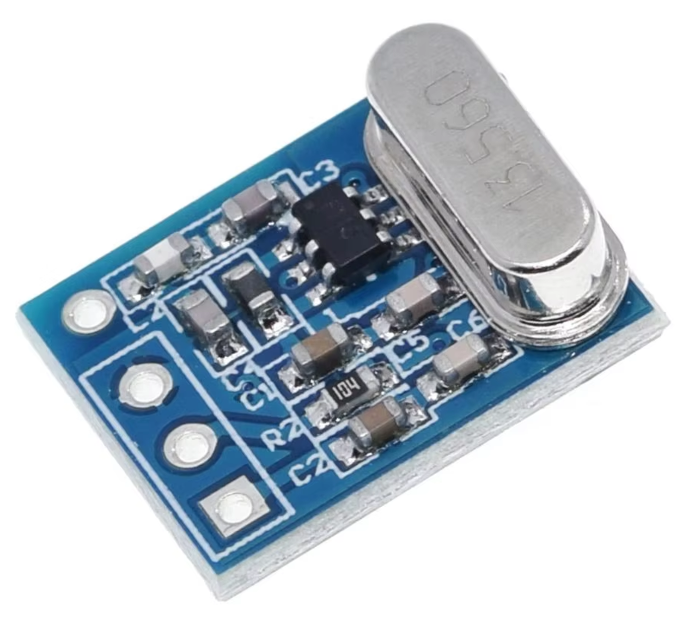
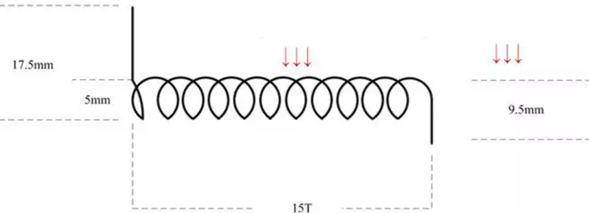
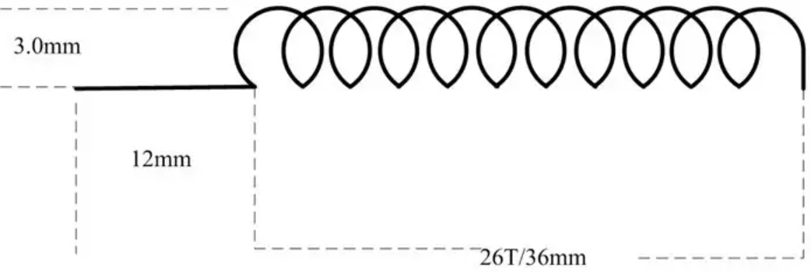

# SYN115 TX Module

< [Back to README](README.md)

The frequency is 433MHz. It is very popular for remote control systems, such as Fan Controllers, Remote Power Switches, Multi-Media Remote Control, Remote Sensor Data Links, Infrared Transmitter Replacement  etc.

DIY antenna: 20 turns ( + 2x half turns at each end) on 3.5mm drill bit = 25cm wound into a coil.

The SYN115 has no EN pin instead the IC switches off if there is no data input transients for a time exceeding approximately **75ms**.

The SYN115 is easy to use. It requires a reference frequency (**RF carrier frequency divided by 32 times**) generated from a crystal with a few additional external parts to create a complete versatile transmitter.

PLL 13.560MHz X 32 = 433.92

- About the transmitter module (square shape)
    - Model: SYN115
    - Material: Plastic Metal
    - Colour: shown as pictures
    - Size: 15x11.8mm
    - Operating frequency: 433.92 MHz
    - Mains input voltage range: 1.8V-3.6V
    - Shutdown mode current 1uA
    - Transfer rate: up to < 10KHz
    - Launch distance: 20-200 meters
    - External antenna: **25cm** ordinary multi-core or single-core line
    - Temperature range: –40°C to +85°C
    - Operating current : 9.6mA
    - Output Power: < 10dBm
    - Modulation mode: OOK/ASK (Amplitude Modulation)

Stats with ATTINY212 1Mhz and HT333 + 2x10M pullups

- TX: 9.6mA
- Sleep: 5.3uA
- Running: 651.7uA 

## Antenna selection Description

#### General application mode

For general application mode ,the antenna can directly adopt the general specifications from the market;

The specific information as follows:

The antenna’s core of conductor diameter(including the Antenna skin): 1.0mm,(except the Antenna skin): 0.5mm ;

The wire length of weld end: 17.5mm, the wire length of antenna terminal: 9.5mm;

The diameter of antenna winding (including the Antenna skin):5mm;

The turn number of winding: 15 turns

### The diagrammatic drawing:

#### The special enhancement mode

The general application mode cannot satisfy if you need farther communication distance, so the special enhancement mode can receive farther communication distance, and the specific information as follows:

433Mhz Antenna

The antenna’s core of conductor diameter (including the Antenna skin): 1.0mm; (except the Antenna skin): 0.35mm

The wire length of weld end: 12mm

The diameter of antenna winding (except the Antenna skin):3.0mm;

The turn number of winding: 26 turns; The length of the winding: 36mm

### The diagrammatic drawing:

Links:

- https://www.pishop.co.za/store/433-mhz-superheterodyne-rf-receiver-and-transmitter-modules?keyword=433&category_id=0
- https://smallpdf.com/unlock-pdf

